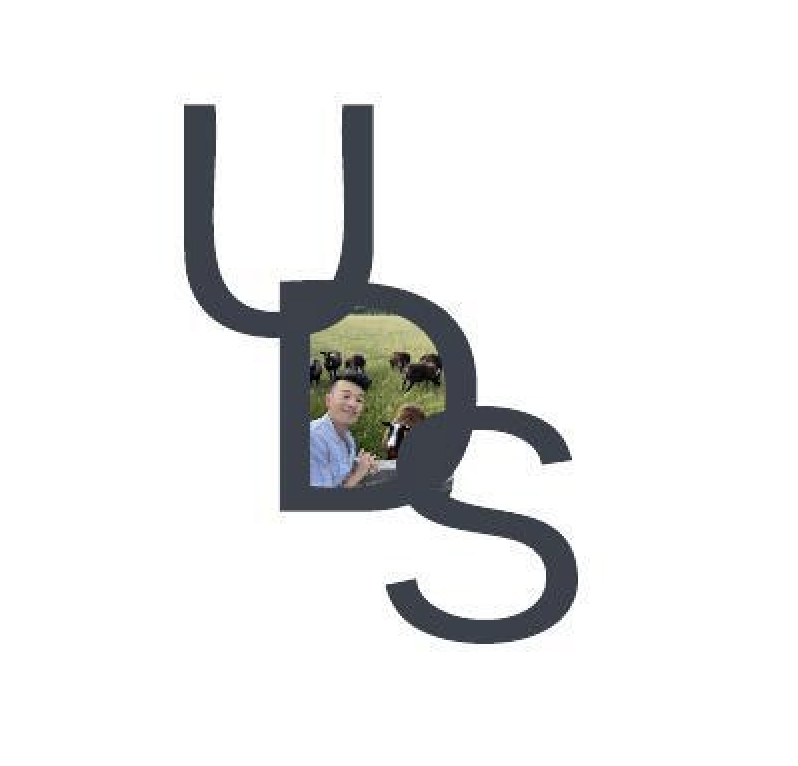
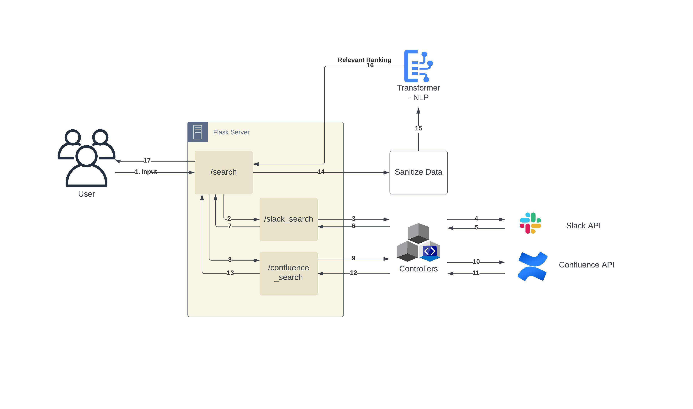

# Intro

With the ever-increasing exposure and mention of AI, rather than continuing to fear it, I decided to embark on a 72-hour deep dive into all things AI! The primary goal was for me to learn about AI. During this process, I developed a tool that could be trained for/by individual companies to execute semantic search within their own enterprise environment.

In the first 24 hours, I acquired basic knowledge of AI, NLP, PyTorch, and HuggingFace. Additionally, I gained insights into the pros and cons of different AI models, learned how to load a model, and applied basic fine-tuning techniques.

Over the following 48 hours, I developed a centralized search endpoint capable of conducting relevant searches across different platforms. (For this project, I integrated Slack and Confluence).

# Design / Flow

1. A user makes a request via Postman to the service with a search string.
2. The Flask server utilizes REST API endpoints to interact with and query search results from Slack and Confluence using the Slack API and Confluence API.
3. The results are sanitized, formatted, and combined, and the overall search result is provided to a Transformer (NLP) model, which returns a Relevant Ranking to the user as a response.

# Future Implementation Ideas

1. **Testing** - Create unit tests, component tests, and end-to-end (E2E) tests to ensure the basic validity of functions and outputs.
2. **Jenkins** - Integrate a CI/CD process that allows automatic testing with each PR change and release. Apply coding and release practices such as Semantic Release, linting, and code coverage.
3. **Cloud** Hosting - Host the server on AWS or another cloud-based environment to increase robustness and reliability.
4. **Cache** - Implement daily caching instead of hitting endpoints on each call to increase speed and reduce costs.
5. **Load Balancing** - Utilize AWS Elastic Load Balancing or a similar solution now that the project is hosted on the cloud. This will increase availability, enable automatic scaling, and enhance security.
6. **View** - Create a front-end for users to interact with the tool and a command-line tool for scripting and easy access.
7. **AI** - Create better data and train the model for more specific criteria. 

## Links and Documentation

**Installation**

- HuggingFace - Transformers https://huggingface.co/docs/transformers/installation
- Ruff - https://github.com/astral-sh/ruff

**Confluence Access**

- Token Generation- https://id.atlassian.com/manage-profile/security/api-tokens

**Slack Access**

- Token https://api.slack.com/apps
- Edit Scope

**API Documentation**

- Slack Web API Documentation - https://api.slack.com/web
- Confluence REST API Documentation - Search by text - https://developer.atlassian.com/server/confluence/cql-field-reference/#text

## Linter & Formatter

`ruff check .`

`ruff format .`
`ruff format . --check`

## Search Steps

**Confluence**

1. python app.py - starts local server
2. http://0.0.0.0:8080/confluence/search?q=capybara

**Slack**

1. python app.py - starts local server
2. http://0.0.0.0:8080/slack/search?q=capybara

**Postman**

http://0.0.0.0:8080/slack/search?q=capybara
http://0.0.0.0:8080/confluence/search?q=capybara

## Search targets

By default, searching `capybara` should return a result with the word `capybara` and all words that starts with `capbara`*

## Training

This is an ongoing goal!

Model - https://huggingface.co/FacebookAI/roberta-base

